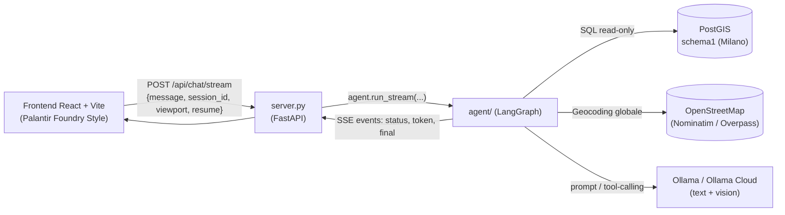
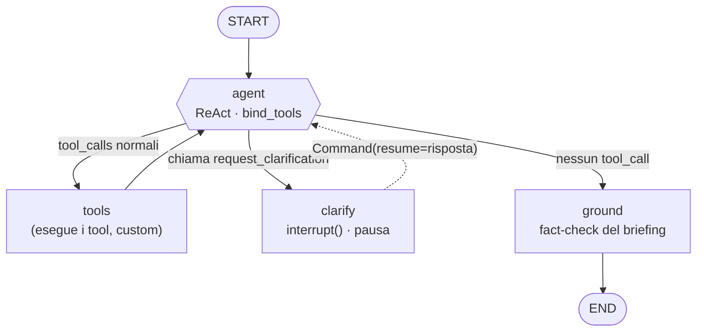
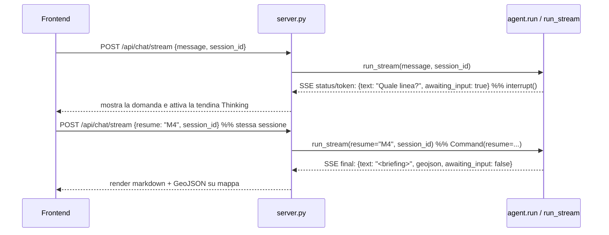

# 🧠 A.E.G.I.S. — Architettura dell'Agente GEOINT

Questo documento illustra l'architettura dettagliata dell'agente GEOINT di A.E.G.I.S.: un **agente LangGraph a stato esplicito** che traduce il linguaggio naturale dell'operatore in query PostGIS, disegna geometrie tattiche, analizza immagini satellitari e produce briefing verificati — il tutto integrato con guardrail di sola lettura, riparazione topologica, mascheramento OPSEC, telemetria in tempo reale con visualizzazione del *Thinking Process* e memoria conversazionale persistente.

---

## 📑 Indice dei Contenuti

- [1. Visione d'insieme](#1-visione-dinsieme)
- [2. Struttura del Package `agent/`](#2-struttura-del-package-agent)
- [3. Il Grafo LangGraph](#3-il-grafo-langgraph)
  - [Stato condiviso (`AgentState`)](#stato-condiviso-agentstate)
  - [Nodi e archi del flusso ReAct](#nodi-e-archi-del-flusso-react)
- [4. I Tool dell'Agente](#4-i-tool-dellagente)
  - [Geolocalizzazione Globale: geocoder + viewport](#geolocalizzazione-globale-geocoder--viewport)
- [5. Sicurezza — Difesa a Quattro Strati](#5-sicurezza--difesa-a-quattro-strati)
- [6. Contratto Pausa/Riprendi & Time-Travel](#6-contratto-pausariprendi--time-travel)
  - [Time-Travel & State Rewind](#6-bis-time-travel--state-rewind)
  - [Persistenza Messaggi di Chiarimento (`resume`)](#6-ter-persistenza-messaggi-di-chiarimento-resume)
- [7. Vincolo Tecnico: niente `langgraph.prebuilt`](#7-vincolo-tecnico-niente-langgraphprebuilt)
- [8. Percorsi Speciali di `run()` e `run_stream()`](#8-percorsi-speciali-di-run-e-run_stream)
- [9. Configurazione & Ambiente (`.env`)](#9-configurazione--ambiente-env)
- [10. Testing & Validazione](#10-testing--validazione)
- [11. Flusso End-to-End, Streaming SSE & UI Thinking Dropdown](#11-flusso-end-to-end-streaming-sse--ui-thinking-dropdown)
  - [Conversazioni Persistenti](#11-bis-conversazioni-persistenti)
  - [Frontend Real-Time Thinking Dropdown](#11-ter-frontend-real-time-thinking-dropdown)
- [12. Limiti Noti & Note Operative](#12-limiti-noti--note-operative)

---

## 1. Visione d'insieme

L'operatore scrive in linguaggio naturale (es. *"ospedali entro 1 km da Duomo e disegna il raggio"* oppure *"traccia le vie principali di Padova"*). L'agente:

1. **ragiona** e sceglie quali strumenti usare (loop ReAct multi-step con limite di ricorsione a **25 passi**);
2. genera **SQL/PostGIS** per i dati del DB locale (Milano) oppure interroga **OpenStreetMap globale** per qualsiasi città/luogo al mondo;
3. applica **validazione statica** e **sola lettura** per le query DB;
4. può **chiedere chiarimenti** all'operatore se la richiesta è ambigua (human-in-the-loop);
5. scrive un **briefing tattico** e lo passa da un nodo di **grounding** anti-invenzione;
6. applica **topology repair** e **redaction OPSEC**, poi restituisce testo + **GeoJSON** da renderizzare sulla mappa Leaflet;
7. trasmette gli eventi in **streaming SSE**, renderizzando in tempo reale nel nuovo frontend **React + Framer Motion** i token del *Thinking Process*, gli **skeleton loader** animati e i layer cartografici vettoriali.

Il cuore backend è uno `StateGraph` di **LangGraph**; l'interfaccia frontend è una **Single-Page Application moderna in React 19, TypeScript, Tailwind CSS, Framer Motion e Three.js** collocata in `frontend/`.



---

## 2. Struttura del Package `agent/`

Ogni modulo ha una responsabilità singola e un'interfaccia netta; le funzioni pure sono testabili senza DB né LLM.

| Modulo | Responsabilità |
|---|---|
| `config.py` | Carica e **valida** l'ambiente (`.env`). Espone `Config`: `schema`, `db_uri`, `llm_url`, `text_model`/`vision_model` (con fallback a `MODEL_NAME`), `statement_timeout_ms`, `memory_turns`, `top_k`, `tool_calling`, `recursion_limit` (default **25**). |
| `db.py` | `engine`, `SQLDatabase`, `table_info` e **`execute_readonly`** (esecuzione in transazione a sola lettura). |
| `llm.py` | Factory dei modelli Ollama (testo con `temperature=0`, vision multimodale). |
| `safety.py` | Guardrail SQL: `extract_sql` (parsing) + `validate_readonly_sql` (validazione statica). |
| `geocode.py` | Geocoding via Nominatim/OSM diretto (`geocode` → nome/lat/lon/**geometria reale**, iniettabile) + `extract_viewport_bounds` per l'estrazione sicura dei confini cartografici + `current_viewport` (ContextVar) per il bias sulla vista. |
| `geometry.py` | Helper geometrie: `feature_collection` (wrap GeoJSON) + `buffer_geometry` (buffer metrico in UTM). |
| `geojson.py` | Helper GeoJSON: `merge_geojson` (unione e pulizia FC), `geojson_reducer` (reducer per `AgentState`), sentinella `RESET_GEOJSON`. |
| `overpass.py` | `fetch_street` (via intera, case-insensitive) + `fetch_streets` (batch con **fuzzy match** sui nomi reali) + `resolve_place` (ibrido Nominatim+Overpass). **Cache** di sessione, throttle ~1/s e retry contro il rate-limit. |
| `conversations.py` | Persistenza delle chat: CRUD conversazioni/messaggi in `schema1` + `derive_title` (titolo automatico). |
| `prompts.py` | Prompt spezzati: `AGENT_SYSTEM_PROMPT` (con regole di geocodifica globale OSM e direttiva anti-loop), template SQL / geometry / spatial, grounding, vision, briefing. Schema **iniettato** da `Config.SCHEMA`. |
| `tools.py` | `run_sql_pipeline` (condivisa) + `make_graph_tools` (i tool del grafo) + `request_clarification` + `make_tools` (legacy fallback). |
| `graph.py` | Il **`StateGraph`**: stato, nodi (`agent`/`tools`/`clarify`/`ground`), routing. |
| `skills/` | Package skills avanzate: `dynamic_registry` (`SkillRegistry` per indicizzazione/routing tool), `spatial_code_interpreter` (Python/GeoPandas REPL), `remote_sensing` (NDVI/NDWI/NDBI), `tactical_weather_elevation` (Open-Meteo & DEM Viewshed). |
| `topology.py` | **GeoJSON Topology Guardrail**: `repair_geojson` (riparazione topologica via Shapely `make_valid` / `explain_validity`). |
| `opsec.py` | **OPSEC Redaction Guardrail**: `redact_text` e `OpsecLoggingFilter` (mascheramento automatico token, chiavi e coordinate sensibili nei log e nei briefing). |
| `evaluator.py` | **Spatial Telemetry & LLM-as-a-Judge**: `evaluate_briefing_consistency` (valutazione coerenza semantica testo/GeoJSON e controllo allucinazioni numeriche). |
| `vision.py` | Analisi immagine satellitare (`analyze_satellite_image`). |
| `memory.py` | Store conversazionale del fallback (il grafo usa il checkpointer nativo). |
| `orchestrator.py` | Orchestratore imperativo di fallback (modelli senza tool-calling). |
| `__init__.py` | **Wiring**: costruisce il grafo compilato, gestisce il checkpointer `DualPostgresSaver`/`MemorySaver`, espone Time-Travel (`get_state_history`, `rewind_checkpoint`), la funzione sincrona `run(...)` e il generatore asincrono `run_stream(...)` per lo streaming SSE con estrazione corretta degli interrupt da `state.tasks`. |

---

## 3. Il Grafo LangGraph

### Stato condiviso (`AgentState`)

```python
class AgentState(TypedDict):
    messages: Annotated[list, add_messages]          # cronologia Human/AI/Tool
    geojson:  Annotated[Optional[str], geojson_reducer]  # GeoJSON accumulato NEL turno
    session_id: str
    viewport: Optional[dict]                         # vista corrente dell'operatore
```

- `messages` usa il reducer nativo `add_messages` (append; sostituisce i messaggi con lo stesso `id`).
- `geojson` usa un reducer custom `geojson_reducer`: **accumula** le FeatureCollection dentro un turno (multi-step) ma si **azzera** all'inizio di un turno nuovo grazie al sentinella `RESET_GEOJSON` passato da `run()`.
- Il **checkpointer** è `MemorySaver` (in-memory) o `DualPostgresSaver` (persistente), con `thread_id = conversation_id`: la memoria conversazionale è nativa del grafo e ripristinabile per il resume.

### Nodi e archi del flusso ReAct



- **`agent`** — lega i tool al modello (`text_llm.bind_tools`) e invoca con `AGENT_SYSTEM_PROMPT` + la cronologia. Decide il passo successivo.
- **`tools`** — nodo **scritto a mano** (niente `langgraph.prebuilt`, vedi §7): per ogni `tool_call` esegue il tool, produce una `ToolMessage` con lo stesso `tool_call_id` e fonde il GeoJSON dei vari tool. L'arco `tools → agent` chiude il **loop ReAct** → nasce il multi-step.
- **`clarify`** — attivato quando l'agente chiama `request_clarification`: invoca `interrupt({"question": ...})`, **mettendo in pausa** il grafo. Alla ripresa aggiunge una `ToolMessage` con la risposta dell'operatore e torna ad `agent`.
- **`ground`** — dopo l'ultimo messaggio senza tool: passa bozza + dati dei tool al `GROUNDING_TEMPLATE` e **riscrive** il briefing rimuovendo ciò che i dati non supportano (single-pass). Sostituisce il messaggio finale (stesso `id`).

**Routing** (`route_after_agent`): nessun `tool_call` → `ground`; presenza di `request_clarification` → `clarify`; altrimenti → `tools`. Il `recursion_limit` (default **25**) limita i giri ReAct per prevenire blocchi in loop infiniti.

---

## 4. I Tool dell'Agente

Ogni tool è un `@tool` LangChain (per il binding/schema) ma ritorna un **dict** `{"summary": str, "geojson": str | None}` che il nodo `tools` interpreta.

| Tool | Ambito & Descrizione |
|---|---|
| `query_intel(request)` | **Database Intelligence Locale**: NL→SQL su `schema1` (trova/elenca/conta fermate metro, parchi, ospedali nel DB di Milano). |
| `spatial_analysis(request)` | **Analisi spaziale derivata su DB Locale**: distanza, nearest (`<->`), `ST_DWithin`, `ST_Intersects` sulle tabelle di Milano. |
| `locate_place(place)` | **Geometria Reale Mondiale (OSM)**: traccia una via/piazza/città/POI al mondo usando la sua geometria OSM reale (LineString/Polygon/Point). Non limitata a Milano. |
| `buffer_around(place, radius_m)` | **Buffer sul Luogo Reale (OSM)**: buffer metrico (default 500 m) attorno alla geometria reale di un luogo ovunque nel mondo. |
| `trace_streets(places)` | **Batch Vie (OSM)**: traccia PIÙ vie in **una sola query** Overpass globale. Per *"le 5 vie principali di X"*. |
| `draw_geometry(request)` | **Tactical Geometry Sintetica**: costruisce geometrie PostGIS da **coordinate esplicite** (corridoio tra coord, poligono con vertici dati). Non geocodifica, non tocca il DB. |
| `spatial_code_interpreter(python_code)` | **GeoPython Sandboxed REPL**: esegue script Python isolati (GeoPandas, Shapely, SciPy) per calcolare tessellazioni di **Voronoi**, convex hull e clustering spaziale. |
| `analyze_multispectral_band(...)` | **Remote Sensing Analytics**: analisi multispettrale satellitare (**NDVI** vegetazione/mimetizzazione, **NDWI** specchi d'acqua/allagamenti, **NDBI** infrastrutture edificate). |
| `get_tactical_weather(lat, lon)` | **Tactical Meteorology**: recupera condizioni meteo live (vento, nubi, umidità) via Open-Meteo REST API per supporto droni/dispersioni. |
| `calculate_elevation_profile(...)` | **DEM & Viewshed Analysis**: quota terreno s.l.m. e calcolo dell'orizzonte visivo (raggio Line-Of-Sight teorico). |
| `request_clarification(question)` | **Sentinella Human-in-the-loop**: la sua chiamata instrada verso il nodo `clarify` (non esegue nulla). |

### Geolocalizzazione Globale: geocoder + viewport

Per evitare che l'LLM **indovini** le coordinate/forme (causa di geometrie fuori posto):

- **Geocodifica Globale (OpenStreetMap)**: `locate_place`, `trace_streets` e `buffer_around` utilizzano Nominatim e Overpass API a livello **mondiale**. Non sussiste alcuna restrizione geografica a Milano per gli elementi cartografici.
- **`extract_viewport_bounds`** (`agent/geocode.py`): estrae in modo sicuro i confini `(south, west, north, east)` da qualsiasi formato di viewport ricevuto dal frontend (`bounds: [[s, w], [n, e]]`, chiavi dirette `north/south/east/west` o fallback su `center: [lat, lon]`), evitando `KeyError` o blocchi di esecuzione.
- **Ibrido Nominatim + Overpass** (`agent/overpass.py`, `resolve_place`): Nominatim è già completo per piazze/parchi/edifici; **solo per le strade** (una LineString = un tratto) si interroga **Overpass** (`fetch_street`) per unire tutti i tratti nel bbox → la **via intera** (MultiLineString). Fallback a Nominatim se Overpass fallisce.
- **Viewport della mappa** — il frontend manda `viewport` (centro + bounds); entra in `AgentState`, iniettato nel system prompt (`OPERATOR MAP VIEW`) per *"attorno a qui"*, e **biasa** il geocoding (viewbox Nominatim) via il `ContextVar` `current_viewport` impostato da `run()` e `run_stream()`.

---

## 5. Sicurezza — Difesa a Quattro Strati

> [!IMPORTANT]
> Per un sistema agentico GEOINT, garantire sicurezza del DB, integrità della mappa e riservatezza dei dati è la priorità #1. La difesa è strutturata su **quattro livelli indipendenti**:

**Strato 1 — Validazione statica SQL** (`safety.validate_readonly_sql`), prima di qualsiasi esecuzione:
- deve essere **una sola** statement e iniziare con `SELECT`/`WITH`;
- blocco keyword pericolose (`INSERT/UPDATE/DELETE/DROP/ALTER/CREATE/TRUNCATE/GRANT/…`);
- blocco cataloghi di sistema (`information_schema`, `pg_*`);
- allow-list dello schema: i riferimenti `FROM/JOIN schema.tabella` devono puntare a `Config.SCHEMA`.
- In caso di violazione → `UnsafeQueryError`, la query **non viene mai eseguita**.

**Strato 2 — Esecuzione difensiva DB** (`db.execute_readonly`):
- `SET statement_timeout` + `SET default_transaction_read_only = on`, poi **`commit`** così la transazione della SELECT eredita davvero il read-only;
- anche se lo Strato 1 venisse aggirato, il DB **rifiuta** ogni scrittura (`ReadOnlySqlTransaction`).

**Strato 3 — GeoJSON Topology Repair** (`topology.repair_geojson`):
- Ispeziona ogni FeatureCollection generata dall'agente o da Shapely;
- Ripara automaticamente poligoni auto-intersecanti (`make_valid`), anelli non chiusi e geometrie degenerate;
- Garantisce al 100% che il rendering su Leaflet non sollevi mai eccezioni o artefatti grafici nel browser.

**Strato 4 — OPSEC Redaction & Telemetry Evaluator** (`opsec.py` e `evaluator.py`):
- `redact_text`: applica un filtro di mascheramento automatico a token di sessione, chiavi riservate e coordinate sensibili (`[REDACTED_KEY]`, `[REDACTED_TOKEN]`) nei briefing e nei log.
- `evaluate_briefing_consistency`: valuta l'allineamento semantico tra il testo del briefing e i dati GeoJSON, rilevando e segnalando eventuali allucinazioni numeriche.

---

## 6. Contratto Pausa/Riprendi & Time-Travel

`run(message, session_id, image=None, mime_type="image/jpeg", resume=None, viewport=None, conversation_id=None) -> {"text", "geojson", "awaiting_input", "evaluation"}`



- Al **turno nuovo**: input `{"messages":[Human(message)], "geojson": RESET_GEOJSON, ...}`.
- Se il grafo si **interrompe** (rilevato nello snapshot da `state.tasks[...].interrupts`), `run_stream` e `run` ritornano la domanda con `awaiting_input: true`.
- Il frontend invia il messaggio successivo come **`resume`** (stesso `session_id`) → `run_stream` riprende con `Command(resume=...)`, il checkpointer ripristina lo stato.

### 6-bis. Time-Travel & State Rewind

Sfruttando la cronologia del checkpointer di LangGraph, il sistema supporta il **riavvolgimento dello stato dell'agente**:
- `GET /api/conversations/{id}/history`: restituisce la lista dei checkpoint registrati nel tempo (`get_state_history`).
- `POST /api/conversations/{id}/rewind`: ripristina lo stato del grafo al `checkpoint_id` specificato (`rewind_checkpoint`), permettendo all'operatore di esplorare ipotetici scenari tattici alternativi a partire da un turno passato.

### 6-ter. Persistenza Messaggi di Chiarimento (`resume`)

In `server.py`, le risposte inviate dall'utente in fase di chiarimento (dove `request.message` è vuoto e il testo risiede in `request.resume`) vengono estratte tramite `user_text = request.message or request.resume`. Questo garantisce che ogni risposta fornita all'agente venga **regolarmente salvata nella tabella `schema1.messages` di PostgreSQL**.

---

## 7. Vincolo Tecnico: niente `langgraph.prebuilt`

> [!NOTE]
> Nell'ambiente attuale `langgraph 1.0.6` è **incompatibile** con il `langchain-core 0.3.63` installato: `langgraph.prebuilt` (`ToolNode`, `create_react_agent`) non importa. Funzionano invece `StateGraph`, `add_messages`, `MemorySaver`, `interrupt`, `Command`.

Per non aggiornare lo stack (romperebbe l'agente esistente), il nodo `tools` è **scritto a mano**. Questo dà anche pieno controllo su GeoJSON, riparazione topologica e grounding.

---

## 8. Percorsi Speciali di `run()` e `run_stream()`

| Condizione | Comportamento |
|---|---|
| `engine is None` (DB offline) e nessuna immagine | i tool geo/vision funzionano; i tool SQL rispondono `DATABASE_OFFLINE` |
| `config.tool_calling == False` | **fallback** all'`Orchestrator` imperativo (routing a parole chiave, niente grafo) |
| immagine presente | shortcut **vision**: `analyze_satellite_image(vision_llm, ...)`, fuori dal grafo |
| altrimenti | esecuzione del **grafo LangGraph** (sincrona o streaming SSE) |

---

## 9. Configurazione & Ambiente (`.env`)

| Variabile | Ruolo |
|---|---|
| `DB_*`, `TARGET_SCHEMA` | Connessione PostGIS e schema (`schema1`). |
| `LLM_URL`, `MODEL_NAME` | Endpoint Ollama e modello base (locale es. `llava:latest` o cloud con `ollama signin`). |
| `TEXT_MODEL` / `VISION_MODEL` | Override (fallback a `MODEL_NAME`); il vision deve essere multimodale. |
| `STATEMENT_TIMEOUT_MS` | Timeout query DB (default 5000). |
| `MEMORY_TURNS` | Turni tenuti in memoria dal fallback (default 6). |
| `TOP_K` | Limite massimo righe restituite dalle query (default 100). |
| `AGENT_TOOL_CALLING` | `off` forza il fallback a router. |
| `RECURSION_LIMIT` | Max passi ReAct per turno del grafo LangGraph (default **25**). |

---

## 10. Testing & Validazione

La test suite automatizzata conta **130 unit test** eseguiti tramite `pytest`:

```bash
python -m pytest tests/ -v
```

Copertura dei test:
- `safety`: parsing SQL, sanitizzazione fences markdown, blocco DDL/DML, blocco cataloghi di sistema.
- `config`: validazione `.env`, override modelli e limite di ricorsione a 25.
- `tools` & `prompts`: contratti dict, geocodifica globale, fallback offline, template SQL e grounding.
- `graph` & `stream`: loop ReAct multi-step, accumulo/reset GeoJSON, estrazione interrupt da snapshot `state.tasks`, test di streaming asincrono.
- `section4`: topology repair su geometrie complesse, OPSEC redaction, evaluator consistency e state rewind (time travel).
- `skills`: REPL GeoPython sandboxed, indici multispettrali satellitari (NDVI/NDWI/NDBI), meteo live e profilo altimetrico DEM.

---

## 11. Flusso End-to-End, Streaming SSE & UI Thinking Dropdown

### Flusso End-to-End (Riassunto)

```
Operatore  →  aegis.html (session_id, markdown render)
           →  POST /api/chat/stream
           →  server.py  →  agent.run_stream(message, session_id, viewport, resume?)
                          →  LangGraph: agent ⇄ tools (ReAct) [⇄ clarify] → ground
                                         │
                                         ├─ run_sql_pipeline → safety (Strato 1) → execute_readonly (Strato 2) → PostGIS
                                         ├─ locate_place/buffer_around/trace_streets → Nominatim + Overpass (Mondiale)
                                         └─ briefing verificato + GeoJSON
           ←  SSE stream: status (steps) → token (text chunks) → final (GeoJSON + metrics)
           ←  render: Thinking Dropdown interattivo + markdown in chat + GeoJSON su Leaflet
```

### 11-bis. Conversazioni Persistenti & Modello DB

Le chat e gli utenti sono salvati nello schema dedicato `schema1`:
- **`schema1.auth`**: Gestione autenticazione utenti con password cifrate via **BCrypt**.
- **`schema1.conversations`**: Tabella conversazioni con chiave primaria `UUID` e vincolo **Foreign Key** (`operator_id REFERENCES schema1.auth(username) ON DELETE CASCADE`).
- **`schema1.messages`**: Cronologia messaggi in relazione 1:N con `conversations` e pulizia automatica a cascata.
- **Tabelle Spaziali (`parks`, `fermate_metro`, `hospitals`)**: Tutte equipaggiate con colonna PostGIS **`geom geometry(..., 4326)`** e relativi **indici GiST** per query di vicinanza e intersezione ad alta velocità.

Il checkpointer impiega `DualPostgresSaver` con un `ConnectionPool` `psycopg` (1-5 connessioni) resiliente ai riavvii di Postgres. Se il DB è disattivato, degrada a `MemorySaver`.

### 11-ter. Modern React + Three.js Palantir Foundry Architecture (`frontend/`)

L'interfaccia utente collocata nella cartella `frontend/` adotta la **tassonomia di sviluppo e l'architettura a pannelli componibili (Tiling Workspace System) di Palantir Foundry / Gotham**, mantenendo al contempo la tavolozza dei colori ambra scuro (`#050505`, `#f59e0b`):

- **Tipografia Standard Palantir**:
  - `Inter`: Utilizzato per l'interfaccia utente primaria, i titoli ed i controlli di navigazione (standard Palantir Foundry).
  - `JetBrains Mono`: Utilizzato per la telemetria, il codice, i log ReAct ed i dati cartografici (standard Palantir Gotham / Defense Console).
- **Ticker di Telemetria di Sistema (Palantir Status Bar)**:
  - Barra superiore ad alta densità informativa che mostra in tempo reale lo stato dell'Ontologia Palantir, la connessione al DB PostGIS, il motore di ragionamento LangGraph, il livello di cifratura AES-256 e la latenza.
- **Pannelli Modulari Tassonomici (Palantir Workspace Panels)**:
  - **Pannello Sinistro (`Sidebar.tsx`)**: *Ontology & Thread Explorer* per l'esplorazione e ricerca ad alta densità delle missioni operative, con eliminazione singola chat via `apiFetch('/api/conversations/{id}', { method: 'DELETE' })`.
  - **Pannello Centrale (`ChatContainer.tsx` + `Composer.tsx`)**: *Intelligence Feed & ReAct Agent Stream* per la trasmissione delle query, la visualizzazione dei token e l'esecuzione degli strumenti.
  - **Pannello Destro (`MapView.tsx` / `ThreeCanvas.tsx`)**: *Geospatial & 3D Intelligence Tile* con custom popup Leaflet in stile Palantir (sfondo nero `#0a0a0a`, bordo ambra `#f59e0b` e testo bianco `#ffffff`) e canvas **Three.js** con morfogenesi particellare LERP fluida (passaggio tra B-2 Stealth Bomber ed F-22 Raptor).
- **Persistenza Sessione (`sessionStorage`)**:
  - Stato dell'operatore memorizzato in `sessionStorage` (`aegis_auth_user`): ad ogni nuovo riavvio o nuova scheda viene richiesta l'autenticazione obbligatoria via `AuthPortal.tsx`.

---

## 12. Limiti Noti & Note Operative

- **Attributi non presenti nel DB** (es. vie *"più trafficate"*, *"più importanti"*): il DB locale contiene solo fermate metro, parchi e ospedali di Milano. Per domande su concetti non numerati (come il traffico), l'agente chiede un chiarimento all'operatore per specificare le vie/piazze da geocodificare.
- **Nomi delle vie (Overpass)**: `trace_streets` fa **fuzzy match** sui nomi reali della vista (difflib, soglia 0.8) — tollera maiuscole e piccole differenze (*"Corso Vittorio Emanuele"* → *"Corso Vittorio Emanuele Secondo"*).
- **Overpass pubblico**: soggetto a rate-limit. Mitigato da **cache di sessione**, **throttle ~1/s**, **retry con backoff** e **batch** (una query per le geometrie).
- **DB spento**: i tool geo (`locate_place`/`buffer_around`/`trace_streets`) e la vision **funzionano** anche senza DB. Solo i tool SQL (`query_intel`/`spatial_analysis`/`draw_geometry`) rispondono `DATABASE_OFFLINE` in modo pulito.
- **Autenticazione Ollama Cloud**: se si impiega un modello cloud (es. `nemotron-3-ultra:cloud`), è necessaria l'autenticazione tramite `ollama signin` per evitare risposte `401 Unauthorized`. In alternativa, si possono configurare modelli locali (es. `llava:latest`).
- **Reconnaissance satellitare (`/api/scan`)**: `server.py` gestisce `POST /api/scan` accettando sia formati con `viewport` che confini geografici espliciti per la cattura diretta di tile ottiche da satellite (Esri World Imagery via `contextily`) e analisi multimodale immediata via vision LLM.
- **Checkpointer Postgres**: usa `DualPostgresSaver` ed un `ConnectionPool` per supportare sia l'invocazione sincrona `run()` che lo streaming asincrono `run_stream()`, gestendo riconnessioni automatiche.
