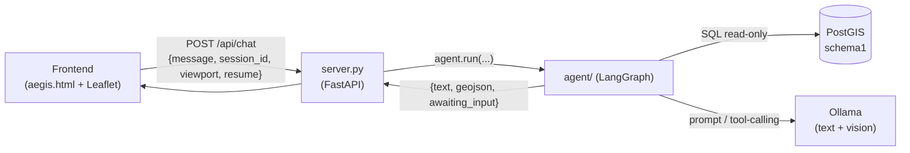
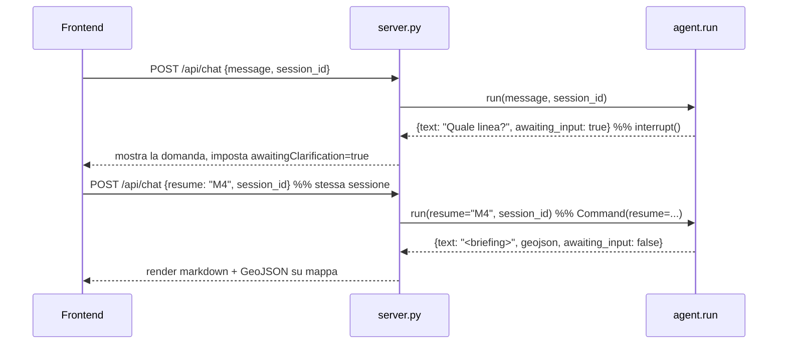

# 🧠 A.E.G.I.S. — Architettura dell'Agente

Questo documento spiega come è fatto l'agente GEOINT di A.E.G.I.S.: un **agente LangGraph a stato esplicito** che traduce il linguaggio naturale dell'operatore in query PostGIS, disegna geometrie tattiche, analizza immagini satellitari e produce briefing verificati — il tutto con guardrail di sola lettura e memoria conversazionale.

---

## 1. Visione d'insieme

L'operatore scrive in linguaggio naturale (es. *"ospedali entro 1 km da Duomo e disegna il raggio"*). L'agente:

1. **ragiona** e sceglie quali strumenti usare (loop ReAct multi-step);
2. genera **SQL/PostGIS**, lo **valida** (sola lettura) e lo **esegue** su un DB PostGIS;
3. può **chiedere chiarimenti** all'operatore se la richiesta è ambigua (human-in-the-loop);
4. scrive un **briefing tattico** e lo passa da un nodo di **grounding** anti-invenzione;
5. restituisce testo + **GeoJSON** da renderizzare sulla mappa Leaflet.

Il cuore è un `StateGraph` di **LangGraph**; l'orchestrazione imperativa precedente resta come **fallback** per modelli senza tool-calling nativo.



---

## 2. Struttura del package `agent/`

Ogni modulo ha una responsabilità singola e un'interfaccia netta; le funzioni pure sono testabili senza DB né LLM.

| Modulo | Responsabilità |
|---|---|
| `config.py` | Carica e **valida** l'ambiente (`.env`). Espone `Config`: `schema`, `db_uri`, `text_model`/`vision_model` (con fallback a `MODEL_NAME`), `statement_timeout_ms`, `memory_turns`, `tool_calling`, `recursion_limit`. |
| `db.py` | `engine`, `SQLDatabase`, `table_info` e **`execute_readonly`** (esecuzione in transazione a sola lettura). |
| `llm.py` | Factory dei due modelli Ollama (testo con `temperature=0`, vision). |
| `safety.py` | Guardrail SQL: `extract_sql` (parsing) + `validate_readonly_sql` (validazione statica). |
| `geocode.py` | Geocoding via Nominatim/OSM diretto (`geocode` → nome/lat/lon/**geometria reale**, iniettabile) + `current_viewport` (ContextVar) per il bias sulla vista. |
| `geometry.py` | Helper geometrie: `feature_collection` (wrap GeoJSON) + `buffer_geometry` (buffer metrico in UTM). |
| `overpass.py` | `fetch_street` (via intera, case-insensitive) + `fetch_streets` (batch con **fuzzy match** sui nomi reali) + `resolve_place` (ibrido Nominatim+Overpass). **Cache** di sessione, throttle ~1/s e retry contro il rate-limit. |
| `conversations.py` | Persistenza delle chat: CRUD conversazioni/messaggi in `schema1` + `derive_title` (titolo automatico). |
| `prompts.py` | Tutti i prompt spezzati: system dell'agente, template SQL / geometry / spatial, grounding, vision, briefing. Schema **iniettato** da `Config.SCHEMA`. |
| `tools.py` | `run_sql_pipeline` (condivisa) + `make_graph_tools` (i tool del grafo) + `request_clarification` + `make_tools` (legacy fallback). |
| `graph.py` | Il **`StateGraph`**: stato, nodi (`agent`/`tools`/`clarify`/`ground`), routing. |
| `vision.py` | Analisi immagine satellitare (`analyze_satellite_image`). |
| `memory.py` | Store conversazionale del fallback (il grafo usa il checkpointer nativo). |
| `orchestrator.py` | Orchestratore imperativo di fallback (modelli senza tool-calling). |
| `__init__.py` | **Wiring**: costruisce il grafo compilato e la funzione pubblica `run(...)`. |

`server.py` importa `agent` e resta sottile; `js/script.js` gestisce `session_id` e il contratto pausa/riprendi.

---

## 3. Il grafo LangGraph

### Stato condiviso (`AgentState`)

```python
class AgentState(TypedDict):
    messages: Annotated[list, add_messages]          # cronologia Human/AI/Tool
    geojson:  Annotated[Optional[str], geojson_reducer]  # GeoJSON accumulato NEL turno
    session_id: str
```

- `messages` usa il reducer nativo `add_messages` (append; sostituisce i messaggi con lo stesso `id`).
- `geojson` usa un reducer custom `geojson_reducer`: **accumula** le FeatureCollection dentro un turno (multi-step) ma si **azzera** all'inizio di un turno nuovo grazie al sentinella `RESET_GEOJSON` passato da `run()`.
- Il **checkpointer** è `MemorySaver` (in-memory), con `thread_id = session_id`: la memoria conversazionale è nativa del grafo e ripristinabile per il resume.

### Nodi e archi


- **`agent`** — lega i tool al modello (`text_llm.bind_tools`) e invoca con `AGENT_SYSTEM_PROMPT` + la cronologia. Decide il passo successivo.
- **`tools`** — nodo **scritto a mano** (niente `langgraph.prebuilt`, vedi §7): per ogni `tool_call` esegue il tool, produce una `ToolMessage` con lo stesso `tool_call_id` e fonde il GeoJSON dei vari tool. L'arco `tools → agent` chiude il **loop ReAct** → nasce il multi-step.
- **`clarify`** — attivato quando l'agente chiama `request_clarification`: invoca `interrupt({"question": ...})`, **mettendo in pausa** il grafo. Alla ripresa aggiunge una `ToolMessage` con la risposta dell'operatore e torna ad `agent`.
- **`ground`** — dopo l'ultimo messaggio senza tool: passa bozza + dati dei tool al `GROUNDING_TEMPLATE` e **riscrive** il briefing rimuovendo ciò che i dati non supportano (single-pass). Sostituisce il messaggio finale (stesso `id`).

**Routing** (`route_after_agent`): nessun `tool_call` → `ground`; presenza di `request_clarification` → `clarify`; altrimenti → `tools`. Il `recursion_limit` (default 12) limita i giri ReAct.

---

## 4. I tool

Ogni tool è un `@tool` LangChain (per il binding/schema) ma ritorna un **dict** `{"summary": str, "geojson": str | None}` che il nodo `tools` interpreta.

| Tool | Cosa fa |
|---|---|
| `query_intel(request)` | **Database Intelligence**: NL→SQL su `schema1` (trova/elenca/conta fermate, parchi, ospedali). |
| `spatial_analysis(request)` | **Analisi spaziale derivata**: distanza, nearest (`<->`), `ST_DWithin`, `ST_Intersects`. |
| `locate_place(place)` | **Geometria reale**: traccia una via/piazza/POI usando la sua geometria OSM reale (LineString/Polygon/Point). Per *"traccia/contorno/segna X"*. |
| `buffer_around(place, radius_m)` | **Buffer sul luogo reale**: buffer (default 500 m) attorno alla geometria reale di un luogo. Per *"area/raggio attorno a X"*. |
| `trace_streets(places)` | **Batch vie**: traccia PIÙ vie in **una sola query** Overpass (niente rate-limit). Per *"le 5 vie principali di X"*. Usa la vista mappa. |
| `draw_geometry(request)` | **Tactical Geometry sintetica**: costruisce geometrie PostGIS da **coordinate esplicite** (corridoio tra coord, poligono con vertici dati). Non geocodifica, non tocca il DB. |
| `request_clarification(question)` | **Sentinella** human-in-the-loop: la sua chiamata instrada verso il nodo `clarify` (non esegue nulla). |

I tre tool SQL condividono `run_sql_pipeline`, il cui ciclo è:

```
genera SQL  →  extract_sql  →  validate_readonly_sql  →  execute_readonly
                                     │ (unsafe)              │ (errore)
                                     ▼                       ▼
                               REQUEST_DENIED         re-immetti l'errore
                                                       e riprova (max 3)
```

### Geolocalizzazione: geocoder + viewport

Per evitare che l'LLM **indovini** le coordinate/forme (causa di geometrie fuori posto), i luoghi con nome usano la **geometria reale** di OSM:

- **`agent/geocode.py`** interroga Nominatim direttamente (`polygon_geojson=1`) e ritorna `{name, lat, lon, geometry}` — la **geometria reale** (la LineString della via, il Polygon della piazza; fallback Point). HTTP iniettabile → test offline.
- **`locate_place`** rende quella geometria direttamente sulla mappa (per *"traccia X"*); **`buffer_around`** ne calcola il **buffer metrico** (`agent/geometry.py`, riproiezione in **UTM** con geopandas/shapely) per *"area attorno a X"*. Così l'LLM non ricostruisce più la forma.
- **Ibrido Nominatim + Overpass** (`agent/overpass.py`, `resolve_place`): Nominatim è già completo per piazze/parchi/edifici; **solo per le strade** (una LineString = un tratto) si interroga **Overpass** (`fetch_street`) per unire tutti i tratti nel bbox → la **via intera** (MultiLineString). Fallback a Nominatim se Overpass fallisce.
- **Viewport della mappa** — il frontend manda `viewport` (centro + bounds); entra in `AgentState`, iniettato nel system prompt (`OPERATOR MAP VIEW`) per *"attorno a qui"*, e **biasa** il geocoding (viewbox Nominatim) via il `ContextVar` `current_viewport` impostato da `run()` — evitando `InjectedState` (in `langgraph.prebuilt`, incompatibile).
- Geocoding fallito → `request_clarification` (niente coordinate inventate).

---

## 5. Sicurezza — sola lettura a doppio strato

Per un sistema che genera SQL da input naturale, impedire scritture è la priorità #1. La difesa è su **due livelli indipendenti**:

**Strato 1 — validazione statica** (`safety.validate_readonly_sql`), prima di qualsiasi esecuzione:
- deve essere **una sola** statement e iniziare con `SELECT`/`WITH`;
- blocco keyword pericolose (`INSERT/UPDATE/DELETE/DROP/ALTER/CREATE/TRUNCATE/GRANT/…`);
- blocco cataloghi di sistema (`information_schema`, `pg_*`);
- allow-list dello schema: i riferimenti `FROM/JOIN schema.tabella` devono puntare a `Config.SCHEMA`.
- In caso di violazione → `UnsafeQueryError`, la query **non viene mai eseguita**.

**Strato 2 — esecuzione difensiva** (`db.execute_readonly`):
- `SET statement_timeout` + `SET default_transaction_read_only = on`, poi **`commit`** così la transazione della SELECT eredita davvero il read-only;
- anche se lo Strato 1 venisse aggirato, il DB **rifiuta** ogni scrittura (`ReadOnlySqlTransaction`). *(Verificato dal vivo.)*

---

## 6. Contratto pausa/riprendi (human-in-the-loop)

`run(message, session_id, image=None, mime_type="image/jpeg", resume=None, viewport=None) -> {"text", "geojson", "awaiting_input"}`



- Al **turno nuovo**: input `{"messages":[Human(message)], "geojson": RESET_GEOJSON, ...}`.
- Se il grafo si **interrompe** (`__interrupt__` presente), `run` ritorna la domanda con `awaiting_input: true`.
- Il frontend, se `awaiting_input` era `true`, invia il messaggio successivo come **`resume`** (stesso `session_id`) → `run` riprende con `Command(resume=...)`, il checkpointer ripristina lo stato.

---

## 7. Vincolo tecnico: niente `langgraph.prebuilt`

Nell'ambiente attuale `langgraph 1.0.6` è **incompatibile** con il `langchain-core 0.3.63` installato: `langgraph.prebuilt` (`ToolNode`, `create_react_agent`) non importa. Funzionano invece `StateGraph`, `add_messages`, `MemorySaver`, `interrupt`, `Command`. Per non aggiornare lo stack (romperebbe l'agente esistente), il nodo `tools` è **scritto a mano**. Questo dà anche pieno controllo su GeoJSON e grounding.

---

## 8. Percorsi speciali di `run()`

| Condizione | Comportamento |
|---|---|
| `engine is None` (DB offline) e nessuna immagine | ritorna `"Tactical engine offline."` |
| `config.tool_calling == False` | **fallback** all'`Orchestrator` imperativo (routing a parole chiave, niente grafo) |
| immagine presente | shortcut **vision**: `analyze_satellite_image(vision_llm, ...)`, fuori dal grafo |
| altrimenti | esecuzione del **grafo LangGraph** |

---

## 9. Config & ambiente (`.env`)

| Variabile | Ruolo |
|---|---|
| `DB_*`, `TARGET_SCHEMA` | Connessione PostGIS e schema (`schema1`). |
| `LLM_URL`, `MODEL_NAME` | Endpoint Ollama e modello base. |
| `TEXT_MODEL` / `VISION_MODEL` | Override (fallback a `MODEL_NAME`); il vision deve essere multimodale (es. `llava`). |
| `STATEMENT_TIMEOUT_MS` | Timeout query DB (default 5000). |
| `MEMORY_TURNS` | Turni tenuti in memoria dal fallback (default 6). |
| `AGENT_TOOL_CALLING` | `off` forza il fallback a router. |
| `RECURSION_LIMIT` | Max passi ReAct per turno (default 12). |

---

## 10. Testing

Test sulle funzioni pure e sul grafo, **senza DB né LLM** (fake + LLM scriptati):
- `safety` (validazione/parsing), `config`, `memory`, `geojson` (merge + reset), `prompts`;
- `tools` (contratto dict, unsafe bloccato, retry);
- `graph` (loop multi-step, accumulo + reset geojson, grounding, `interrupt`/`resume`);
- `db` (preambolo read-only).

Esecuzione: `python -m pytest tests/ -v`.

---

## 11. Flusso end-to-end (riassunto)

```
Operatore  →  aegis.html (session_id, markdown render)
           →  POST /api/chat
           →  server.py  →  agent.run(message, session_id, viewport, resume?)
                          →  LangGraph: agent ⇄ tools (ReAct) [⇄ clarify] → ground
                                         │
                                         ├─ run_sql_pipeline → safety (Strato 1) → execute_readonly (Strato 2) → PostGIS
                                         ├─ locate_place/buffer_around/trace_streets → Nominatim + Overpass
                                         └─ briefing verificato + GeoJSON
           ←  {text, geojson, awaiting_input}
           ←  render: markdown in chat + GeoJSON su Leaflet
```

---

## 11-bis. Conversazioni persistenti

Le chat sono salvate in due tabelle applicative (`schema1.conversations`, `schema1.messages`), create in modo idempotente all'avvio (`ensure_schema`). Ogni conversazione appartiene a un `operator_id` (quello del login) e ha un titolo generato dal primo messaggio (`derive_title`).

Il **checkpointer** di LangGraph usa Postgres quando disponibile (`build_checkpointer`), con `thread_id = conversation_id`: contesto e chiarimenti in sospeso sopravvivono al riavvio del server. Se le dipendenze o il DB mancano, si degrada a `MemorySaver` (memoria volatile) senza bloccare l'app.

La sidebar permette di creare, elencare, aprire, rinominare ed eliminare le conversazioni; `/api/chat` salva i messaggi e aggiorna il titolo al primo scambio.

---

## 12. Limiti noti

- **Attributi non presenti nel DB** (es. vie *"più trafficate"*, *"più importanti"*): il DB contiene solo fermate metro, parchi e ospedali di Milano. Domande su traffico/importanza → la **scelta dei luoghi è una stima dell'LLM**, non fondata su dati, e il nodo `ground` non può verificarla.
- **Nomi delle vie (Overpass)**: `trace_streets` fa **fuzzy match** sui nomi reali della vista (difflib, soglia 0.8) — tollera maiuscole e piccole differenze (*"Corso Vittorio Emanuele"* → *"Corso Vittorio Emanuele Secondo"*). Nomi troppo diversi restano fuori (elencati nel `summary`); il fuzzy è limitato al **bbox della vista**.
- **Overpass pubblico**: soggetto a rate-limit. Mitigato da **cache di sessione**, **throttle ~1/s**, **retry con backoff** e **batch** (una query per le geometrie). Se bloccato → fallback al tratto di Nominatim. La prima query dei nomi su un bbox ampio può richiedere ~20-30 s; le successive sono immediate (cache).
- **DB spento**: i tool geo (`locate_place`/`buffer_around`/`trace_streets`) e la vision **funzionano** anche senza DB. Solo i tool SQL (`query_intel`/`spatial_analysis`/`draw_geometry`, che valutano PostGIS) rispondono `DATABASE_OFFLINE` in modo pulito.
- **Tool-calling del modello**: il grafo assume che `TEXT_MODEL` supporti il tool-calling nativo; con `AGENT_TOOL_CALLING=off` si passa all'orchestratore imperativo di fallback (senza i tool geo).
- **Vision**: richiede un `VISION_MODEL` multimodale.
- **`operator_id` non è verificato**: separa le conversazioni per operatore ma, senza autenticazione reale, un client può richiedere l'elenco di un altro `operator_id`. L'auth (JWT/sessioni) resta una feature a parte.
- **Riapertura chat**: vengono ricaricati i messaggi, non i layer GeoJSON storici sulla mappa (il GeoJSON è salvato ma non ridisegnato).
- **Checkpointer Postgres**: usa un `ConnectionPool` (1-5 connessioni, `check_connection`), quindi si **riprende da solo** se una connessione cade (riavvio di Postgres, timeout, rete) e regge più operatori concorrenti. In precedenza una singola connessione tenuta aperta per la vita del processo, una volta chiusa, faceva fallire ogni turno con `the connection is closed` fino al riavvio dell'app.
- **Turno solo-immagine**: se il messaggio è vuoto e c'è solo un'immagine, la risposta dell'agente viene salvata ma non il messaggio utente, e il titolo non viene derivato da quel turno.
