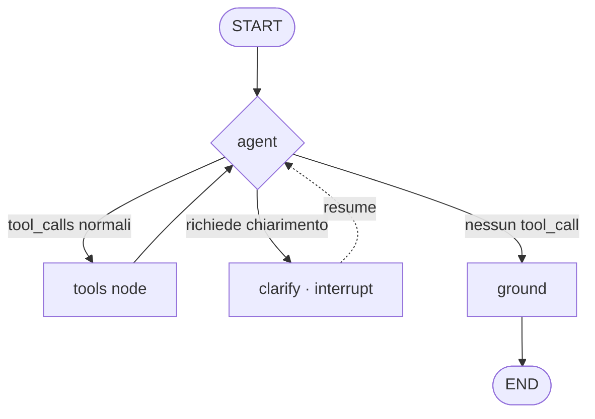

# A.E.G.I.S. — Agente LangGraph multi-nodo

**Data:** 2026-07-25
**Stato:** Design approvato (in attesa di review finale dello spec)
**Scope:** Il layer agente (`agent/`). Migrazione dell'orchestratore imperativo a un `StateGraph` LangGraph, con nuovi nodi/tool. Modifiche minime a `server.py` e `js/script.js` per il contratto pausa/riprendi del human-in-the-loop.

---

## 1. Obiettivo

Estendere l'agente A.E.G.I.S. da orchestratore imperativo a **grafo a stato esplicito** (LangGraph `StateGraph`), aggiungendo quattro capacità:

1. **Ragionamento multi-step** — un loop ReAct (`agent ↔ tools`) che concatena più tool in un singolo turno.
2. **Analisi spaziale** — un tool `spatial_analysis` con funzioni PostGIS derivate (`ST_Distance`, `ST_DWithin`, `ST_Intersects`, KNN `<->`).
3. **Chiarimento (human-in-the-loop)** — un nodo `clarify` che, via `interrupt()`, mette in pausa il grafo e chiede all'operatore quando mancano dati, poi riprende.
4. **Grounding del briefing** — un nodo `ground` che verifica che la risposta finale non affermi nulla non supportato dai dati dei tool, e la riscrive se serve.

Approccio scelto: **StateGraph custom (Approccio B)** — controllo pieno su nodi custom, GeoJSON e interrupt.

---

## 2. Vincolo tecnico dirimente (verificato)

Ambiente attuale: `langgraph 1.0.6`, `langgraph-checkpoint 2.1.1`, `langchain-core 0.3.63`, `langchain 0.3.0`, `langchain-community 0.3.0`, `langchain-ollama 0.2.0`.

- `langgraph.prebuilt` (`ToolNode`, `create_react_agent`) **non è importabile**: richiede un `langchain-core` più nuovo (`ImportError: TOOL_MESSAGE_BLOCK_TYPES`).
- Funzionano invece: `langgraph.graph.StateGraph`, `langgraph.graph.message.add_messages`, `langgraph.checkpoint.memory.MemorySaver`, `langgraph.types.interrupt`, `langgraph.types.Command`. Verificato con smoke test end-to-end (interrupt + resume + persistenza per thread).

**Decisione:** NON aggiornare lo stack langchain (romperebbe l'agente attuale e i 52 test). Si costruisce un **tools node custom** (nessun uso di `langgraph.prebuilt`). `langgraph` va aggiunto alle dipendenze; nessun'altra modifica di versione.

---

## 3. Architettura del grafo

**Stato condiviso** (`AgentState`, `TypedDict`):
- `messages: Annotated[list, add_messages]` — cronologia (Human/AI/Tool). Reducer nativo.
- `geojson: str | None` — GeoJSON accumulato per la mappa.
- `session_id: str` — usato come `thread_id` del checkpointer.

**Checkpointer:** `MemorySaver` (in-memory). `config = {"configurable": {"thread_id": session_id}}`. La memoria conversazionale diventa nativa del grafo (per-thread).

**Nodi:**

- **`agent`** — lega i tool a `text_llm` (`bind_tools`), invoca con `AGENT_SYSTEM_PROMPT` + `state["messages"]`, ritorna `{"messages": [ai]}`. È il cervello ReAct.
- **`tools`** (custom) — legge `state["messages"][-1].tool_calls`; per ogni chiamata invoca il tool dal registry; il tool ritorna `{"summary": str, "geojson": str | None}`. Il nodo costruisce una `ToolMessage(content=summary, tool_call_id=...)` per ognuna e aggiorna `geojson` (merge delle FeatureCollection se più tool ne producono). Ritorna `{"messages": [...tool_messages], "geojson": merged}`.
- **`clarify`** — attivato quando l'`agent` chiama il tool speciale `request_clarification(question)`. Il nodo chiama `interrupt({"question": question})`, mettendo in pausa il grafo. Alla ripresa (`Command(resume=answer)`), aggiunge una `ToolMessage`/`HumanMessage` con la risposta dell'operatore e torna ad `agent`.
- **`ground`** — dopo che l'`agent` non chiama più tool: prende l'ultima risposta + gli output dei tool presenti in `messages` e, con `GROUNDING_PROMPT`, verifica/riscrive la risposta così che ogni affermazione sia supportata dai dati. Single-pass (nessun loop). Sostituisce il contenuto dell'ultimo messaggio AI.

**Archi condizionali** (da `agent`):
- se l'ultimo AI ha `tool_calls` che includono `request_clarification` → `clarify`
- altrimenti se ha altri `tool_calls` → `tools`
- altrimenti → `ground` → END

`tools → agent` e `clarify → agent` chiudono il loop ReAct. `recursion_limit` (config) limita i passi.

---

## 4. Tool

Tutti i tool sono `@tool` (per il binding/schema) ma ritornano un **dict** `{"summary": str, "geojson": str | None}` interpretato dal `tools` node.

- **`query_intel(request)`** — DB Intelligence (MODE 1). Riadattato: genera→valida→esegue→auto-corregge; ritorna `{"summary": righe, "geojson": gdf.to_json()}`.
- **`draw_geometry(request)`** — Tactical Geometry (MODE 2). Riadattato allo stesso dict.
- **`spatial_analysis(request)`** *(nuovo)* — genera SQL con funzioni spaziali derivate (`ST_Distance`, `ST_DWithin`, `ST_Intersects`, KNN `<->`), stessi guardrail `safety` + `execute_readonly`. Prompt dedicato `SPATIAL_PROMPT`. Abilita: "ospedali entro 1 km da una fermata M4", "fermata più vicina all'ospedale San Raffaele", "parchi che intersecano una zona".
- **`request_clarification(question)`** *(nuovo, sentinella)* — non esegue nulla: la sua presenza nei `tool_calls` instrada verso il nodo `clarify`.

I tre tool SQL condividono un helper `_run_sql_pipeline(generate, request)` (genera→estrai→valida→esegui→correggi) che ritorna il dict.

---

## 5. Guardrail e sicurezza

Invariati e riusati: `safety.validate_readonly_sql` (Strato 1) + `db.execute_readonly` con transazione `READ ONLY`/`statement_timeout` (Strato 2, già verificato live). Ogni tool SQL — incluso `spatial_analysis` — passa da entrambi. `recursion_limit` impedisce loop ReAct infiniti.

---

## 6. Contratto pausa/riprendi (human-in-the-loop)

- **`agent.run(message, session_id, image=None, resume=None) -> dict`**:
  - `config = {"configurable": {"thread_id": session_id}, "recursion_limit": config.recursion_limit}` (default 12, da env `RECURSION_LIMIT`).
  - se `image` presente → shortcut vision fuori dal grafo (come oggi), ritorna `{text, geojson: None, awaiting_input: False}`.
  - se `resume is not None` → `input = Command(resume=resume)`; altrimenti `input = {"messages": [HumanMessage(message)], "session_id": session_id, "geojson": None}`.
  - `result = graph.invoke(input, config)`.
  - se `result` contiene `__interrupt__` → ritorna `{"text": question, "geojson": None, "awaiting_input": True}`.
  - altrimenti → estrae il contenuto dell'ultimo messaggio AI e `geojson` dallo stato; ritorna `{"text", "geojson", "awaiting_input": False}`.

- **`server.py`** — `ChatRequest` acquisisce `resume: str | None`. `/api/chat` passa `resume` ad `agent.run` e include `awaiting_input` nella risposta.

- **`js/script.js`** — se l'ultima risposta aveva `awaiting_input: true`, il messaggio successivo dell'operatore viene inviato come `resume` (stesso `session_id`) invece che come nuovo `message`; un flag locale traccia lo stato "in attesa di chiarimento".

---

## 7. Struttura del package

**Nuovi/riadattati:**
- `agent/graph.py` *(nuovo)* — `AgentState`, `build_graph(deps) -> CompiledGraph`, i nodi (`agent`, `tools`, `clarify`, `ground`) e il routing condizionale.
- `agent/tools.py` *(riadattato)* — `make_tools(...)` ritorna `[query_intel, draw_geometry, spatial_analysis, request_clarification]`; i tool ritornano dict; rimosso il parametro `ctx`.
- `agent/prompts.py` *(esteso)* — aggiunge `SPATIAL_PROMPT`, `GROUNDING_PROMPT`; `AGENT_SYSTEM_PROMPT` documenta i nuovi tool e quando chiedere chiarimenti.
- `agent/__init__.py` *(riadattato)* — costruisce il grafo compilato e instrada `run()`.
- `agent/geojson.py` *(nuovo, piccolo)* — `merge_geojson(a, b) -> str` per accumulare FeatureCollection multi-step.

**Invariati e riusati:** `config.py` (+ `RECURSION_LIMIT`), `db.py`, `llm.py`, `safety.py`, `vision.py`.

**Percorso di fallback (preservato):** `orchestrator.py` + `memory.py` restano come **fallback** quando `config.tool_calling` è `off` (modelli senza tool-calling): `run()` instrada al grafo se `tool_calling` è on, altrimenti all'`Orchestrator` imperativo esistente. Nessuna cancellazione di codice/test già verdi.

---

## 8. Testing

- `test_tools.py` *(aggiornato)* — i tool ritornano dict `{"summary","geojson"}`; `spatial_analysis` passa dai guardrail; unsafe bloccato; retry.
- `test_geojson.py` *(nuovo)* — `merge_geojson` unisce due FeatureCollection; gestisce `None`.
- `test_graph.py` *(nuovo)* — grafo compilato con `text_llm` finto (scripta i `tool_calls`) e tool finti:
  - multi-step: due iterazioni `agent→tools→agent` prima della fine.
  - grounding: il nodo `ground` viene invocato e può riscrivere.
  - clarify: `request_clarification` → `interrupt` → il risultato contiene `__interrupt__`; `run(resume=...)` completa.
  - `geojson` emerge nello stato finale.
- `test_prompts.py` *(esteso)* — presenza di `SPATIAL_PROMPT`/`GROUNDING_PROMPT` e placeholder.
- I test esistenti (`config`, `safety`, `memory`, `db`, `vision`, `orchestrator`) restano verdi.

---

## 9. Fuori scope (YAGNI)

- Checkpointer persistente (Postgres): si resta su `MemorySaver`.
- `langgraph.prebuilt` / `create_react_agent`.
- Aggiornamento dello stack langchain-core.
- Streaming degli step verso il frontend.
- Nuove tabelle o dati nel DB.

---

## 10. Rischi e mitigazioni

| Rischio | Mitigazione |
|---|---|
| `langgraph.prebuilt` incompatibile | Tools node custom; nessun uso di prebuilt (§2) |
| Loop ReAct infinito | `recursion_limit` da config |
| Modello senza tool-calling nativo | Fallback all'`Orchestrator` imperativo quando `tool_calling=off` (§7) |
| GeoJSON perso tra i passi | Accumulo via `merge_geojson` nel `tools` node (§3) |
| Interrupt non ripreso dal client | Contratto `awaiting_input`/`resume` esplicito (§6); stato tenuto dal checkpointer |
| Grounding entra in loop | Single-pass, nessun arco di ritorno da `ground` (§3) |

---

## 11. Criteri di successo

- Una richiesta multi-step ("trova gli ospedali e disegna un raggio di 1 km attorno a ciascuno") produce, in un turno, sia le righe sia il GeoJSON combinato.
- `spatial_analysis` risponde a "fermata più vicina a X" con SQL spaziale valido e read-only.
- Una richiesta ambigua provoca una domanda di chiarimento; la risposta dell'operatore (resume) completa il turno mantenendo il contesto.
- Il nodo `ground` rimuove/riscrive affermazioni non supportate dai dati.
- I 52 test esistenti restano verdi; i nuovi test del grafo passano.
